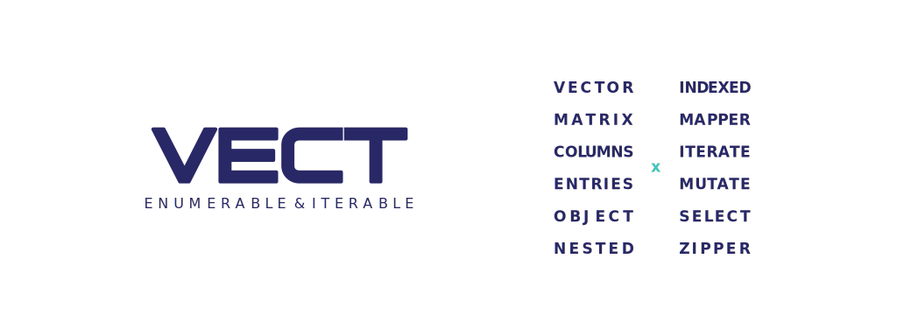

<div style="text-align:center">
	
</div>

#### @vect - iterator extension for vector, matrix, columns, entries, object and nested

[![npm version][badge-npm-version]][url-npm]
[![github commit last][badge-github-last-commit]][url-github]
[![github commit total][badge-github-commit-count]][url-github]
[![npm license][badge-npm-license]][url-npm]

[//]: <> (Shields)
[badge-npm-version]: https://flat.badgen.net/npm/v/@vect/vector
[badge-npm-license]: https://flat.badgen.net/npm/license/@vect/vector
[badge-github-last-commit]: https://flat.badgen.net/github/last-commit/hoyeungw/vect
[badge-github-commit-count]: https://flat.badgen.net/github/commits/hoyeungw/vect

[//]: <> (Link)
[url-github]: https://github.com/hoyeungw/vect
[url-npm]: https://npmjs.org/package/@vect/vector

#### Features
- Flexible and friendly iterator extensions with concise api.
- Functions for various types, applied with generator.
- Fast initialize.
- Categorized functions for installing on need.
- Lightweight.
- Module support.

#### Install

```console
$ npm install @vect/<tool-name>
```

#### Tools
|                                          |                                |      |                  |
|------------------------------------------|--------------------------------|------|------------------|
| [**vector**](packages/pkg-core/vector)   | Functions for 1d-array(vector) | core | ![v][vector-dm]  |
| [**matrix**](packages/pkg-core/matrix)   | Functions for 2d-array(matrix) | core | ![v][matrix-dm]  |
| [**column**](packages/pkg-core/column)   | Functions for matrix column    | core | ![v][column-dm]  |
| [**entries**](packages/pkg-core/entries) | Functions for entries          | core | ![v][entries-dm] |
|                                          |                                |      |                  |

[//]: <> (Local routes)
[vector-dm]: https://flat.badgen.net/npm/dm/@vect/vector
[matrix-dm]: https://flat.badgen.net/npm/dm/@vect/matrix
[column-dm]: https://flat.badgen.net/npm/dm/@vect/column
[entries-dm]: https://flat.badgen.net/npm/dm/@vect/entries

#### Mappers
|                                                          |                                    |        |                         |
|----------------------------------------------------------|------------------------------------|--------|-------------------------|
| [**vector-mapper**](packages/pkg-mapper/vector-mapper)   | Mapper/iterate for vector          | mapper | ![v][vector-mapper-dm]  |
| [**matrix-mapper**](packages/pkg-mapper/matrix-mapper)   | Mapper/iterate for matrix elements | mapper | ![v][matrix-mapper-dm]  |
| [**column-mapper**](packages/pkg-mapper/column-mapper)   | Mapper/iterate for matrix column   | mapper | ![v][column-mapper-dm]  |
| [**columns-mapper**](packages/pkg-mapper/columns-mapper) | Mapper/iterate for matrix columns  | mapper | ![v][columns-mapper-dm] |
| [**entries-mapper**](packages/pkg-mapper/entries-mapper) | Mapper/iterate for entries         | mapper | ![v][entries-mapper-dm] |
| [**object-mapper**](packages/pkg-mapper/object-mapper)   | Mapper/iterate for object          | mapper | ![v][object-mapper-dm]  |
|                                                          |                                    |        |                         |

[//]: <> (Local routes)
[vector-mapper-dm]: https://flat.badgen.net/npm/dm/@vect/vector-mapper
[matrix-mapper-dm]: https://flat.badgen.net/npm/dm/@vect/matrix-mapper
[column-mapper-dm]: https://flat.badgen.net/npm/dm/@vect/column-mapper
[columns-mapper-dm]: https://flat.badgen.net/npm/dm/@vect/columns-mapper
[entries-mapper-dm]: https://flat.badgen.net/npm/dm/@vect/entries-mapper
[object-mapper-dm]: https://flat.badgen.net/npm/dm/@vect/object-mapper

#### Zippers
|                                                          |                            |        |                         |
|----------------------------------------------------------|----------------------------|--------|-------------------------|
| [**vector-zipper**](packages/pkg-zipper/vector-zipper)   | Zipper for vector          | zipper | ![v][vector-zipper-dm]  |
| [**matrix-zipper**](packages/pkg-zipper/matrix-zipper)   | Zipper for matrix elements | zipper | ![v][matrix-zipper-dm]  |
| [**column-zipper**](packages/pkg-zipper/column-zipper)   | Zipper for matrix column   | zipper | ![v][column-zipper-dm]  |
| [**columns-zipper**](packages/pkg-zipper/columns-zipper) | Zipper for matrix columns  | zipper | ![v][columns-zipper-dm] |
| [**entries-zipper**](packages/pkg-zipper/entries-zipper) | Zipper for entries         | zipper | ![v][entries-zipper-dm] |
| [**object-zipper**](packages/pkg-zipper/object-zipper)   | Zipper for object          | zipper | ![v][object-zipper-dm]  |
|                                                          |                            |        |                         |

[//]: <> (Local routes)
[vector-zipper-dm]: https://flat.badgen.net/npm/dm/@vect/vector-zipper
[matrix-zipper-dm]: https://flat.badgen.net/npm/dm/@vect/matrix-zipper
[column-zipper-dm]: https://flat.badgen.net/npm/dm/@vect/column-zipper
[columns-zipper-dm]: https://flat.badgen.net/npm/dm/@vect/columns-zipper
[entries-zipper-dm]: https://flat.badgen.net/npm/dm/@vect/entries-zipper
[object-zipper-dm]: https://flat.badgen.net/npm/dm/@vect/object-zipper

#### Indicators
|                                                                  |                               |           |                            |
|------------------------------------------------------------------|-------------------------------|-----------|----------------------------|
| [**vector-indicator**](archive/pkg-indicator/vector-indicator)   | Indicator for vector          | indicator | ![v][vector-indicator-dm]  |
| [**matrix-indicator**](archive/pkg-indicator/matrix-indicator)   | Indicator for matrix elements | indicator | ![v][matrix-indicator-dm]  |
| [**column-indicator**](archive/pkg-indicator/column-indicator)   | Indicator for matrix column   | indicator | ![v][column-indicator-dm]  |
| [**columns-indicator**](archive/pkg-indicator/columns-indicator) | Indicator for matrix columns  | indicator | ![v][columns-indicator-dm] |
| [**entries-indicator**](archive/pkg-indicator/entries-indicator) | Indicator for entries         | indicator | ![v][entries-indicator-dm] |
|                                                                  |                               |           |                            |

[//]: <> (Local routes)
[vector-indicator-dm]: https://flat.badgen.net/npm/dm/@vect/vector-indicator
[matrix-indicator-dm]: https://flat.badgen.net/npm/dm/@vect/matrix-indicator
[column-indicator-dm]: https://flat.badgen.net/npm/dm/@vect/column-indicator
[columns-indicator-dm]: https://flat.badgen.net/npm/dm/@vect/columns-indicator
[entries-indicator-dm]: https://flat.badgen.net/npm/dm/@vect/entries-indicator

#### Select
|                                                          |                                  |        |                         |
|----------------------------------------------------------|----------------------------------|--------|-------------------------|
| [**vector-select**](packages/pkg-select/vector-select)   | Select vector by index list      | select | ![v][vector-select-dm]  |
| [**object-select**](packages/pkg-select/object-select)   | Select object by key list        | select | ![v][object-select-dm]  |
| [**columns-select**](packages/pkg-select/columns-select) | Select columns by column indexes | select | ![v][columns-select-dm] |
|                                                          |                                  |        |                         |

[//]: <> (Local routes)
[vector-select-dm]: https://flat.badgen.net/npm/dm/@vect/vector-select
[object-select-dm]: https://flat.badgen.net/npm/dm/@vect/object-select
[columns-select-dm]: https://flat.badgen.net/npm/dm/@vect/columns-select

#### Update
|                                                          |                                    |        |                         |
|----------------------------------------------------------|------------------------------------|--------|-------------------------|
| [**vector-update**](packages/pkg-update/vector-update)   | Splices vector by index list       | update | ![v][vector-update-dm]  |
| [**columns-update**](packages/pkg-update/columns-update) | Pop/push/(un)shift/splices columns | update | ![v][columns-update-dm] |
|                                                          |                                    |        |                         |

[//]: <> (Local routes)
[vector-update-dm]: https://flat.badgen.net/npm/dm/@vect/vector-update
[columns-update-dm]: https://flat.badgen.net/npm/dm/@vect/columns-update

#### Margins
|                                                         |                    |        |                         |
|---------------------------------------------------------|--------------------|--------|-------------------------|
| [**vector-margin**](archive/pkg-margin/vector-margin)   | Margin for vector  | margin | ![v][vector-margin-dm]  |
| [**matrix-margin**](archive/pkg-margin/matrix-margin)   | Margin for matrix  | margin | ![v][matrix-margin-dm]  |
| [**entries-margin**](archive/pkg-margin/entries-margin) | Margin for entries | margin | ![v][entries-margin-dm] |
|                                                         |                    |        |                         |

[//]: <> (Local routes)
[vector-margin-dm]: https://flat.badgen.net/npm/dm/@vect/vector-margin
[matrix-margin-dm]: https://flat.badgen.net/npm/dm/@vect/matrix-margin
[entries-margin-dm]: https://flat.badgen.net/npm/dm/@vect/entries-margin

#### Quantifiers
|                                                                   |                                  |            |                            |
|-------------------------------------------------------------------|----------------------------------|------------|----------------------------|
| [**matrix-quantifier**](archive/pkg-quantifier/matrix-quantifier) | Every & some for matrix elements | quantifier | ![v][matrix-quantifier-dm] |
| [**column-quantifier**](archive/pkg-quantifier/column-quantifier) | Every & some for matrix column   | quantifier | ![v][column-quantifier-dm] |
|                                                                   |                                  |            |                            |

[//]: <> (Local routes)
[matrix-quantifier-dm]: https://flat.badgen.net/npm/dm/@vect/matrix-quantifier
[column-quantifier-dm]: https://flat.badgen.net/npm/dm/@vect/column-quantifier

#### Misc
|                                  |                         |      |                   |
|----------------------------------|-------------------------|------|-------------------|
| [**callable**](archive/callable) | Create a callable class | misc | ![v][callable-dm] |
|                                  |                         |      |                   |

[//]: <> (Local routes)
[callable-dm]: https://flat.badgen.net/npm/dm/@vect/vector-mapper

#### Meta
[LICENSE (MIT)](LICENSE)
